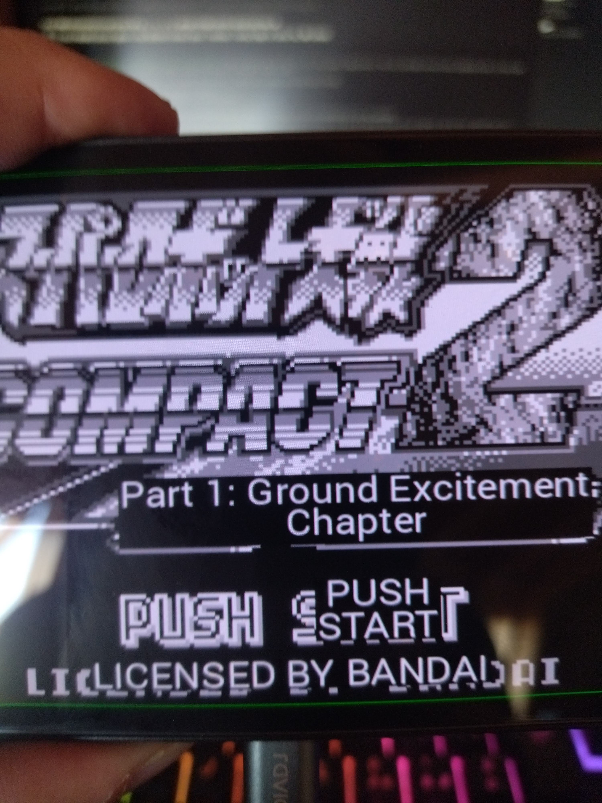

# VGTranslate

A local-first RetroArch AI Service translator: Japanese game text becomes an
English overlay, powered entirely by free software running on your own machine.

It implements the [libretro AI Service wire protocol](https://docs.libretro.com/guides/ai-service/)
on `http://localhost:4404`. RetroArch pauses the game, POSTs a screenshot of the
current frame, and vgtranslate returns a translated overlay (24-bit BGR BMP, by
default rendered at a multiple of native resolution so it stays crisp on screen)
that RetroArch renders on top of the original.

```
RetroArch (paused frame)
   │ POST /  image=<base64>&target_lang=en&output=image
   ▼
vgtranslate ── quality: vision LLM reads + translates the whole frame; RapidOCR
            │          anchors each translation to the exact text line (one shot)
            │  fast:     OCR detect/recognize → text MT per region
            ▼
   { image: <overlay BMP>, image_width, image_height, image_format, ... }
```

## In action

<!--
  SCREENSHOT SLOT — drop the photo of the translated Retroid screen here.
  Save it (e.g. docs/screenshots/retroid-overlay.jpg) and point the image path
  below at it.
-->


## Two translation paths

| Path | Pipeline | When to use |
|---|---|---|
| **quality** (default) | A local vision LLM (LM Studio / Ollama) reads every text region and translates it in one shot; RapidOCR anchors each translation to the exact text line | Most games; best accuracy, needs a GPU |
| **fast** | RapidOCR (CPU) detects/recognizes, then Sugoi (JP→EN) or Argos Translate translates per region | Older machines, or when you want no LLM at all |

Games can be mixed: profiles let you pick a path, OCR engine, translator, upscale
factor and glossary per game (e.g. SRW → quality; Megaman pixel fonts → manga-ocr).

## Highlights

- **Pixel-perfect overlays.** The vision LLM's own box coordinates are too coarse
  for tight overlays, so on the quality path every translation is snapped to the
  precise per-line box that RapidOCR finds in the frame. Text lands exactly on the
  original line, at the right size, with no oversized black bands.
- **True font-metric rendering.** Background fills hug the rendered text (1&nbsp;px
  padding) and glyphs are centered using real ink metrics, so nothing overflows the
  box or rides below the baseline.
- **Reasoning-model friendly.** `skip_reasoning` tells Qwen3.x-style models to skip
  their chain-of-thought before answering, cutting latency on slow local inference
  and avoiding 90&nbsp;s+ timeouts; the default LLM timeout is now 300&nbsp;s.
- **Robust to sloppy LLM output.** The vision-LLM reply is parsed tolerantly:
  trailing prose, ellipses, dropped or malformed JSON items, and both
  `[x1,y1,x2,y2]` corner boxes and `box`/`box_2d` keys are handled.
- **Per-line boxes.** The quality-path prompt asks for one tight box per text line
  (never merged regions), and `box_2d`/`text_content` variants are accepted.

## Quick start

**Windows** — the repo ships ready-made scripts; just double-click (or run in a
terminal) from the project root:

```bat
install.bat   REM creates .venv, installs the engines, prints engine status
run.bat       REM starts the server; pass any command: run.bat tray,
              REM   run.bat serve --detect-llm, run.bat status
```

`install.bat` picks the best Python it can find (3.12/3.11/3.10 first, since the
neural extras need Python <=3.12) and installs `vgtranslate[ocr,ocr-manga,mt-sugoi,tray]`
or a smaller set if your Python is newer. Override with `install.bat all` or
`install.bat ocr,tray`.

**Linux / macOS** — from a shell:

```bash
# 1. install (extras pick the engines you want)
pip install "vgtranslate[ocr,ocr-manga,mt-sugoi,tray]"

# 2. start the server (auto-detects LM Studio on :1234 / Ollama on :11434)
vgtranslate serve --detect-llm
```

The Windows scripts run the same CLI under the hood; manually that is
`.venv\Scripts\python -m vgtranslate serve --detect-llm`.

In RetroArch (v1.18.0+): **Settings → AI Service** on desktop, or **Settings →
Accessibility → AI Service** on Android after enabling **Accessibility**. Turn
the service **ON**, set **AI Service URL** to `http://<PC-LAN-IP>:4404/` (use
the IP printed at server startup — the server binds `0.0.0.0`), set **AI
Service Mode** to **Image**, and bind the **AI Service hotkey** (Settings →
Hotkeys). Press it in-game to pause, translate, and show the overlay. Full
walkthrough: [docs/install-and-run.md](docs/install-and-run.md).

Run `vgtranslate status` to see which engines are available on your machine.

## Dependencies (all optional extras)

| Extra | Engines |
|---|---|
| `ocr` | RapidOCR (ONNX, CPU) — default OCR |
| `ocr-manga` | manga-ocr — stylized/pixel Japanese text |
| `tesseract` | Tesseract via pytesseract — fallback OCR |
| `mt-sugoi` | Sugoi — offline JP→EN text MT |
| `mt-argos` | Argos Translate — offline, many languages |
| `tray` | pystray + Tkinter system-tray app |
| `all` | everything above |

Base install (`fastapi`, `uvicorn`, `httpx`, `Pillow`, `pydantic`) is enough for
the server to run; the quality path needs an LLM server (see docs).

## Command line

```
vgtranslate serve [--detect-llm]   run the translation server
vgtranslate tray                   system-tray app (start/stop, logs, settings)
vgtranslate bench run <dataset>    benchmark a profile against ground truth
vgtranslate status                 engine availability + LLM connection
vgtranslate detect                 probe local LLM endpoints
```

## Documentation

- [Installation & run](docs/install-and-run.md) — setup, LM Studio model, RetroArch config
- [Configuration, profiles & glossary](docs/config-and-profiles.md)

## License

GNU GPL v3 — see [LICENSE](LICENSE).
